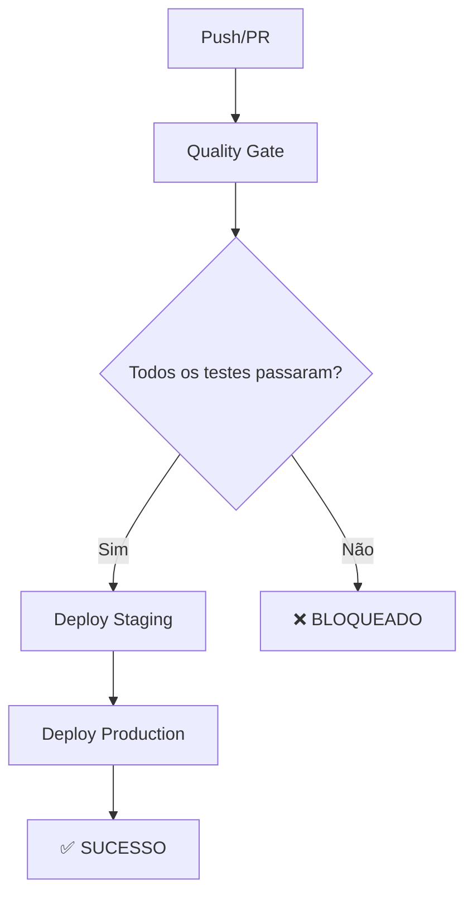

# 🚀 Pipeline CI/CD Seguro - Guia Rápido

## 🎯 O que foi implementado

Um **pipeline CI/CD seguro** que **GARANTE** que apenas código de qualidade seja deployado para produção.

## ⚡ Como usar

### 1. Validação Local (Recomendado)
```bash
# Execute antes de cada push
npm run validate-pipeline
```

### 2. Validação Rápida
```bash
# Validação básica (lint + testes + build)
npm run quality-check
```

### 3. Push Automático
```bash
# O Git hook executa automaticamente a validação
git push origin main
```

## 🛡️ Proteções Implementadas

### ❌ **BLOQUEIA** o deploy se:
- Vulnerabilidades **CRÍTICAS** encontradas
- Erros de **linting**
- **Testes falhando**
- **Cobertura abaixo de 80%**
- **Build falhando**

### ⚠️ **AVISA** mas não bloqueia:
- Vulnerabilidades **moderadas**
- **Console.log** no código
- **Cobertura baixa** (mas acima de 80%)

## 🔄 Fluxo de Trabalho



## 📊 Ambientes

| Ambiente | Branch | URL | Validações |
|----------|--------|-----|------------|
| **Staging** | `development` | `staging-seu-projeto.vercel.app` | Quality Gate |
| **Production** | `main` | `seu-projeto.vercel.app` | Quality Gate + Extras |

## 🛠️ Troubleshooting

### Pipeline falha no GitHub Actions?

1. **Execute localmente primeiro:**
   ```bash
   npm run validate-pipeline
   ```

2. **Verifique os logs** no GitHub Actions

3. **Corrija os problemas** identificados

4. **Faça novo push**

### Deploy não executa?

1. ✅ Quality Gate passou?
2. ✅ Está na branch correta?
3. ✅ Secrets configurados?
4. ✅ Permissões do Vercel?

## 📈 Monitoramento

- 📊 **Cobertura**: Codecov
- 📝 **Logs**: GitHub Actions
- 🔍 **Segurança**: npm audit
- 🚀 **Deploy**: Vercel

## 🔧 Configuração

### Secrets Necessários
```bash
VERCEL_TOKEN=seu_token
VERCEL_ORG_ID=seu_org_id
VERCEL_PROJECT_ID=seu_project_id
```

### Scripts Disponíveis
```bash
npm run validate-pipeline    # Validação completa
npm run quality-check        # Validação rápida
npm run security-audit       # Auditoria de segurança
npm run test:ci             # Testes para CI
```

## 🎉 Benefícios

- ✅ **Zero downtime** em produção
- 🛡️ **Segurança garantida**
- 📊 **Qualidade monitorada**
- 🔄 **Automação total**
- 🚫 **Prevenção de erros**

---

**🚀 Agora seu deploy é 100% seguro!** 